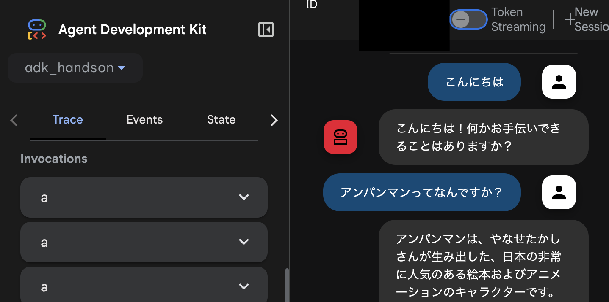

# adk_handson

Google ADK を使用したチャットエージェントのハンズオンプロジェクトです。

## デモ



_作成したエージェントの実行画面_

## 使用したツール・技術

- **Google ADK (Agent Development Kit)**: エージェント開発フレームワーク
- **Gemini 2.5 Flash**: 言語モデル
- **Python**: プログラミング言語
- **Git**: バージョン管理

## プロジェクト構成

```
adk_handson/
├── agent.py              # メインエージェント定義
├── __init__.py          # パッケージ初期化
├── my_agent/            # エージェント実装
│   ├── __init__.py
│   ├── agent.py
│   └── .env            # 環境変数
└── .gitignore          # Git除外設定
```

## エージェント概要

- **名前**: enjoy_chat_agent
- **モデル**: gemini-2.5-flash
- **機能**: ユーザーとの楽しいチャット
